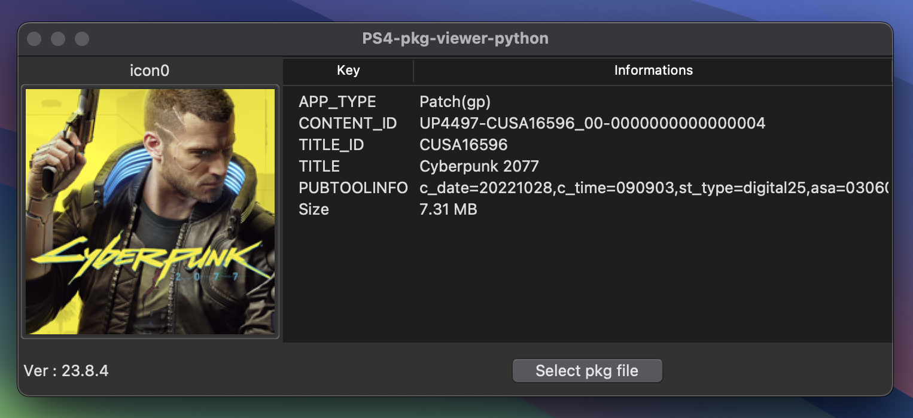
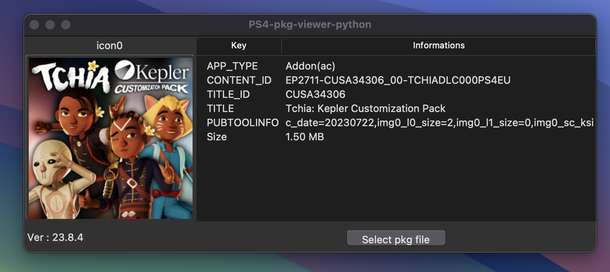
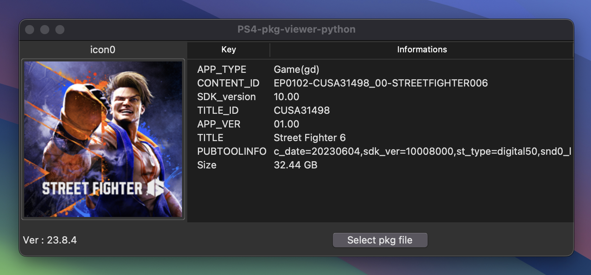
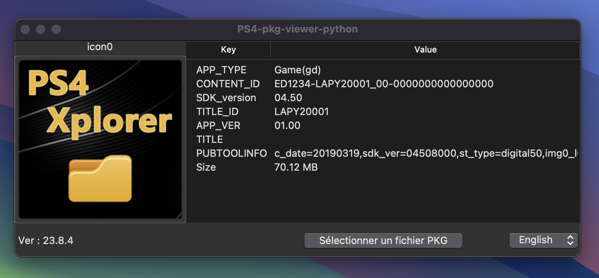

# ps4-pkgtools

Performs some read-only operations on PS4 .pkg files:

## Usage

### Extract

```
python3 main.py extract File.pkg --file 0x126C --out out.mxl
```

Extracts file with ID `0x126C` to `out.xml`. 
The argument to `--file` can be a file ID or filename 

### Info

```
python3 main.py info File.pkg
```

returns:Extracts everything to directory `extracted`


### Dump
```
python3 main.py dump File.pkg --out extracted
```

Extracts everything to directory `extracted`

# PS4-pkg-viewer-python

Displays certain PS4 pkg information such as :
```
APP_TYPE,CONTENT_ID,TITLE_ID,TITLE,APP_VER,SDK_version,PUBTOOLINFO 
```







Note: `TITLEID` may not be recovered correctly under certain conditions.
    this code was developed on macos but can be compiled on Windows after installing all dependencies.
    Add the latest version of the application 

