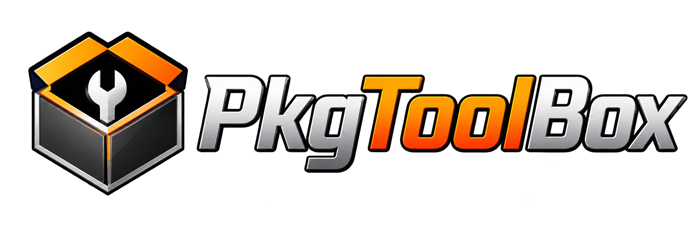

<div align="center">



<br>

**A cross-platform toolbox for inspecting, extracting, modifying, and analyzing PlayStation PKG files.**

<br>

[](https://github.com/seregonwar/PkgToolBox/releases/latest)
[](https://github.com/seregonwar/PkgToolBox/releases)
[](https://github.com/seregonwar/PkgToolBox/stargazers)
[](https://github.com/seregonwar/PkgToolBox/network/members)
[](https://hits.sh/github.com/seregonwar/PkgToolBox/)

</div>

---

## About

**PkgToolBox** is a desktop application for working with PlayStation PKG files.

It provides a unified graphical interface for inspecting package metadata, browsing internal files, extracting and modifying content, working with trophies, analyzing package structures, and performing other PKG-related operations.

PkgToolBox supports package formats used across **PSP, PS3, PS4, and PS5**, although some platform-specific features may still be experimental or under development.

---

## Features

- **PKG Information**
  Inspect package metadata and obtain detailed information about PKG files.

- **GP4 / GP5 Project Workspace**
  Open PS4 `.gp4` and PS5 `.gp5` publishing projects, validate mapped paths,
  inspect `param.sfo` / `param.json`, preview source assets, and export the
  resolved project files. GP5 supports both flat and recursive layouts.

- **Standalone File Inspection**
  Drop or open any local file to preview it and use the integrated text/hex
  inspection flow without first loading a package.

- **File Explorer**  
  Navigate the internal structure of a PKG without extracting the entire package.

- **File Extraction**  
  Extract individual files or dump the contents of a package.

- **Hex Reader & Editor**  
  Inspect and modify files directly in hexadecimal format.

- **Text Reader & Editor**  
  View and edit supported text-based files.

- **File Management**  
  Manage and delete files contained inside supported packages.

- **Trophy Management**  
  Load, unpack, inspect, and manage PlayStation trophy files.

- **Trophy Creator**  
  Create custom trophy sets with configurable icons, descriptions, and achievements.

- **Wallpaper Management**  
  Inspect, extract, and modify wallpapers and background assets included in packages.

- **Encryption-aware extraction**
  Extract plaintext metadata safely and identify protected entries without producing corrupt output.

- **PFS Analysis**  
  Inspect PS4 PFS/PFSC container geometry with the built-in dependency-free engine.

- **PARAM.SFO and image metadata**
  Parse all SFO keys and inspect PNG/DDS dimensions directly in the application.

- **Cross-platform Support**  
  PkgToolBox can run on Windows, Linux, and macOS.

---

## Screenshot

<div align="center">


</div>

---

## Requirements

### Development

- **Python 3.13+**
- **PySide6**
- **PyInstaller**
- Dependencies listed in `requirements.txt`

> [!IMPORTANT]
> Use **PyInstaller** when packaging the application. Alternative packaging tools such as `cx_Freeze` may not preserve all of the behavior required by PkgToolBox.

PkgToolBox does not require shadPKG, OpenOrbis command-line tools, or bundled
platform-specific executables. Protected PS4 PFS payload decryption is reported
as unsupported until the internal key pipeline is fully validated; clear-text
PKG metadata remains browsable and extractable.

---

## Installation

### 1. Clone the repository

```bash
git clone https://github.com/seregonwar/PkgToolBox.git
cd PkgToolBox
```

### 2. Install the dependencies

```bash
pip install -r requirements.txt
```

### 3. Run PkgToolBox

```bash
python main.py
```

---

## Usage

Launch the application and open a PKG, GP4/GP5 project, or standalone file from
the same source picker. Any of them can also be dropped onto the window.

Depending on the package type and platform, PkgToolBox provides tools for:

* browsing package contents;
* extracting individual files;
* performing full package dumps;
* inspecting package metadata;
* modifying supported package information;
* viewing and editing files with the integrated hex editor;
* viewing and editing text files;
* managing trophy files;
* analyzing PFS structures;
* performing supported package-specific operations.

For publishing projects, PkgToolBox resolves mapped paths, shows missing files
without hiding them, and keeps the project read-only while allowing available
content to be browsed, previewed, and exported.

---

## Roadmap

### Completed

#### PKG Analysis & Navigation

* [x] Advanced internal PKG file explorer
* [x] Detailed package information parsing
* [x] Improved hexadecimal value analysis
* [x] PS3 retail and debug PKG support
* [x] PSP PKG support
* [x] Initial PS5 PKG support
* [x] PS5 GP5 project loading (flat and rootdir layouts)
* [x] PS4 GP4 project loading and standalone file workspaces

#### Trophy Support

* [x] PS4 `.trp` trophy support
* [x] PS5 `.ucp` trophy support

#### PFS Support

* [x] ShadPKG integration
* [x] PS4 PFS extraction
* [x] PFS information viewer

#### Platform Support

* [x] Windows support
* [x] Linux support
* [x] macOS support

#### Stability

* [x] Improved error handling
* [x] Improved application stability
* [x] General bug fixes and code improvements

### In Progress / Planned

#### PKG Support

* [ ] Extended PS5 PKG support
* [ ] Advanced PKG splitting
* [ ] Improved FPKG update handling
* [ ] Native PkgToolBox implementation for PS4 and PS5

#### PKG Rebuild

* [ ] Extract, modify, and rebuild supported PKG files
* [ ] Recompute required digests and package metadata where applicable

#### File Decryption

* [ ] `.ESFM` file decryption

---

## Contributing

Contributions are welcome.

If you want to improve PkgToolBox, you can:

* 🐛 [Report a bug](https://github.com/seregonwar/PkgToolBox/issues)
* 💡 [Request a feature](https://github.com/seregonwar/PkgToolBox/issues)
* 🔧 [Open a Pull Request](https://github.com/seregonwar/PkgToolBox/pulls)
* 💬 Contact me on [X / Twitter](https://x.com/SeregonWar)

PkgToolBox is primarily developed and maintained by a single developer, so bug reports, testing, documentation improvements, and code contributions are greatly appreciated.

---

## Acknowledgements

PkgToolBox includes or builds upon work from other members of the PlayStation development community.

* **[Sinajet](https://github.com/sinajet/)**
  Creator of [PS5-Game-Info](https://github.com/sinajet/PS5-Game-Info), used by PkgToolBox to analyze `eboot.bin` files extracted from packages and assist with package identification.

* **[HoppersPS4](https://github.com/HoppersPS4)**
  Creator of the C++ version of [Waste_Ur_Time](https://github.com/HoppersPS4/Waste_Ur_Time), which was rewritten and integrated into the `PS4_Passcode_Bruteforcer.py` module.

* **[zecoxao/gengp4-src](https://github.com/zecoxao/gengp4-src)**,
  **[zecoxao/gengp5-src](https://github.com/zecoxao/gengp5-src)** and
  **[SvenGDK/LibProsperoPKG](https://github.com/SvenGDK/LibProsperoPKG)**
  Public publishing-project schema and model references used to validate
  PkgToolBox's independent Python implementation of GP4/GP5 loading.

* **[SvenGDK/SharpProspero](https://github.com/SvenGDK/SharpProspero)**
  Reference for the broader PS5 development and packaging workflow that the
  consolidated workspace is designed to complement.

If your work is used by PkgToolBox and is missing from this section, please contact me on [X](https://x.com/SeregonWar).

---

## Support Development

PkgToolBox has been actively developed and maintained for several years.

If you use the project and would like to support its continued development, maintenance, testing, and future features, donations are greatly appreciated.

<div align="center">

<a href="https://www.seregonwar.com/donations">
  
</a>

</div>

---

<div align="center">

**Made with ❤️ for the PlayStation homebrew community**

[Releases](https://github.com/seregonwar/PkgToolBox/releases)
•
[Issues](https://github.com/seregonwar/PkgToolBox/issues)
•
[Pull Requests](https://github.com/seregonwar/PkgToolBox/pulls)
•
[Support](https://www.seregonwar.com/donations)

</div>
